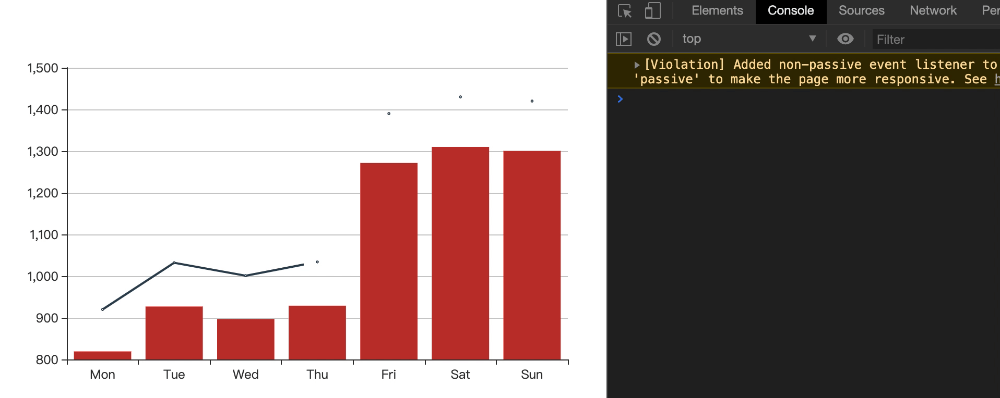
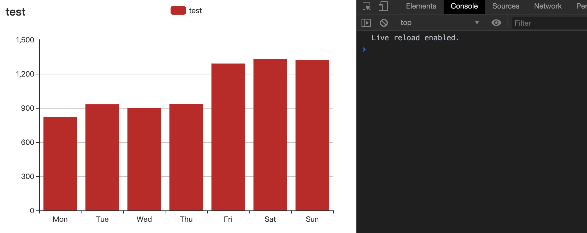

---
nav:
  title: Components
  path: /components
group:
  title: 基础知识
  path: /demo
order: 5
---

# Echarts 事件系统

## 1. 简介

[官方解释:](https://echarts.apache.org/zh/tutorial.html#ECharts%20%E4%B8%AD%E7%9A%84%E4%BA%8B%E4%BB%B6%E5%92%8C%E8%A1%8C%E4%B8%BA) 在 ECharts 的图表中用户的操作将会触发相应的事件。开发者可以监听这些事件，然后通过回调函数做相应的处理，比如跳转到一个地址，或者弹出对话框，或者做数据下钻等等。更多细节可参考 [官网](https://www.echartsjs.com/zh/tutorial.html#ECharts%20%E4%B8%AD%E7%9A%84%E4%BA%8B%E4%BB%B6%E5%92%8C%E8%A1%8C%E4%B8%BA)。

ECharts 开放了两套 API 体系，一是 ECharts [类接口](https://www.echartsjs.com/zh/api.html#echarts)及[实例的接口](https://www.echartsjs.com/zh/api.html#echartsInstance)，例如常用的 echarts.init 方法、echartInstance.setOption()；二是围绕**事件**展开的动态交互接口，包括用于监听事件的 echartInstance.on 函数和用于触发行为的 echartInstance.dispatchAction 函数。

本文讨论使用 echartInstance.on 接口实现的事件监听功能。

## 2. 事件三要素

与 [Dom Event 规范](https://dom.spec.whatwg.org/#introduction-to-dom-events) 类似，ECharts 通过事件名称、事件源、事件参数三个要素精确描述**谁**在**何处**执行了**何种**操作。在展开示例讨论前，有必要简单讨论下 ECharts 事件三要素的含义。

### 2.1 事件名称

ECharts 中存在两种类型的事件，第一种是鼠标在图形示例上的行为所触发的鼠标事件，包括：

- [click](https://developer.mozilla.org/en-US/docs/Web/API/Element/click_event)
- [dbclick](https://developer.mozilla.org/en-US/docs/Web/API/Element/dblclick_event)
- [mousedown](https://developer.mozilla.org/en-US/docs/Web/API/Element/mousedown_event)
- [mousemove](https://developer.mozilla.org/en-US/docs/Web/API/Element/mousemove_event)
- [mouseup](https://developer.mozilla.org/en-US/docs/Web/API/Element/mouseup_event)
- [mouseover](https://developer.mozilla.org/en-US/docs/Web/API/Element/mouseover_event)
- [mouseout](https://developer.mozilla.org/en-US/docs/Web/API/Element/mouseout_event)
- [contextmenu](https://developer.mozilla.org/en-US/docs/Web/API/Element/contextmenu_event)
- globalout

上述事件除 globalout 外，均与 [DOM Event 规范](https://dom.spec.whatwg.org/#introduction-to-dom-events) 定义的同名事件有相同的语义、触发条件。globalout 在鼠标移出图表示例范围时触发。第二种称为行为事件，在组件、图表状态发生某种业务状态迁移时触发，包括：

| 事件名               | 适用组件     | 触发时机                                       |
| -------------------- | ------------ | ---------------------------------------------- |
| legendselectchanged  | legend       | 切换图例选中状态后的事件                       |
| legendselected       | legend       | 图例选中后的事件                               |
| legendunselected     | legend       | 图例取消选中后的事件                           |
| legendscroll         | legend       | 图例滚动事件                                   |
| datazoom             | datazoom     | 数据区域缩放后的事件                           |
| datarangeselected    | visualMap    | 视觉映射组件中，range 值改变后触发的事件       |
| timelinechanged      | timeline     | 时间轴中的时间点改变后的事件                   |
| timelineplaychanged  | timeline     | 时间轴中播放状态的切换事件                     |
| dataviewchanged      | toolbox      | 工具栏中数据视图的修改事件                     |
| magictypechanged     | toolbox      | 工具栏中动态类型切换的切换事件                 |
| brush                | brush        | 选框添加事件                                   |
| globalcursortaken    | brush        | brush 组件捕获鼠标 cursor 时触发               |
| brushselected        | brush        | 选框内容变更事件                               |
| geoselectchanged     | geo          | geo 中地图区域切换选中状态的事件               |
| geoselected          | geo          | geo 中地图区域选中后的事件                     |
| geounselected        | geo          | geo 中地图区域取消选中后的事件                 |
| axisareaselected     | 平行坐标轴   | 平行坐标轴范围选取事件                         |
| pieselectchanged     | 饼图         | 饼图扇形切换选中状态的事件                     |
| pieselected          | 饼图         | 饼图扇形选中后的事件                           |
| pieunselected        | 饼图         | 饼图扇形取消选中后的事件                       |
| mapselectchanged     | 地图         | 地图区域切换选中状态的事件                     |
| mapselected          | 地图         | 地图区域选中后的事件                           |
| mapunselected        | 地图         | 地图区域取消选中后的事件                       |
| focusnodeadjacency   | 连接图       | graph 图邻接节点高亮事件                       |
| unfocusnodeadjacency | 连接图       | graph 的邻接节点取消高亮事件                   |
| restore              | ECharts 实例 | 重置 option 事件                               |
| rendered             | ECharts 实例 | 渲染完成事件                                   |
| finished             | ECharts 实例 | 同样是渲染完成事件，当动画或渐进渲染结束时触发 |

上表只摘录行为事件的关键部分，更详细的介绍请参考 [官网文档](https://www.echartsjs.com/zh/api.html#events)。行为事件的发生代表着组件实体内部状态发生了某些变更，有两种原因可能触发行为事件：

1. 用户交互行为，例如图例组件中，用户通过鼠标点击切换图例开关时，ECharts 除触发鼠标 click 事件外，还会触发 legendselectchanged 行为事件；
1. 接口调用，例如图例组件中，调用 echartInstance.dispatchAction({ type: 'legendToggleSelect' }) 后也依然会触发 legendselectchanged 行为事件。

### 2.2 事件源

**事件源**描述了触发事件的主体，对于鼠标事件，事件源通常是行为发生时鼠标焦点所在图形区域对应的图表。所有类型的图表都支持鼠标事件；部分组件支持触发鼠标事件，但默认是关闭的，需要通过设置 triggerEvent: true 来启动。组件对鼠标事件的支持情况如下：

- 支持：title，xAxis ，yAxis， radiusAxis ，angleAxis，radar ，parallelAxis， singleAxis ，timeline，calendar；
- 不支持： polar ，legend， grid ，datazoom， visualMap， tooltip， axisPointer， toolbox， brush， geo ，parallel， graphic。

> Tips： graphic 是原生图形组件，不支持 echartInstance.on 接口，但可直接调用 [element.onclick](https://www.echartsjs.com/zh/option.html#graphic.elements-group.onclick) 等接口实现事件监听。

行为事件由特定的组件、图表触发，例如 legendselectchanged 的事件源只能是 legend 组件，更多信息请参考 [事件名称](http://www.imooc.com/wiki/#21-%e4%ba%8b%e4%bb%b6%e5%90%8d%e7%a7%b0) 一节。

### 2.3 事件参数

**事件参数**描述事件发生时的上下文信息，ECharts 中不同事件的参数信息相差极大，甚至同种事件在不同组件触发时，回调参数也有差异。

## 3. 监听事件

ECharts 中可通过 [echartInstance.on](https://www.echartsjs.com/zh/api.html#echartsInstance.on) 函数绑定事件处理函数，on 函数签名：

```typescript
(eventName: string, query?: string|Object, handler: Function, context?: Object)
```

各参数说明：

| 参数名 | 类型 | 必选 | 说明 |
| --- | --- | --- | --- |
| eventName | string | 是 | 指定监听的事件名称 |
| query | string&#124;object | 否 | 指定在特定的组件或者元素上响应 ，仅在鼠标事件中有效 |
| handler | function | 是 | 事件回调函数 |
| context | object | 否 | 回调函数执行时的 this 对象，默认为触发事件的 ECharts 实例对象 |

### 3.1 全局监听

若未提供 query 参数，ECharts 将不对事件源做任何过滤，相当于注册了一个全局事件回调。例如：

<code src="./index.tsx"></code>

可以在控制台看打印结果：`click invoke at series`

> **Tips**：需要注意，所谓的**全局监听**并不是所有组件的交互行为都可以被监听，对于鼠标事件，需要满足如下条件：

> 1. 组件本身支持鼠标交互事件。
> 1. 组件启用了鼠标事件功能，所有图表默认启用；其他组件则需要设置 triggerEvent: true 显式声明，如上例的 title、yAxis、xAxis 组件。

在回调函数中，可以通过回调参数的 componentType、componentSubType 等属性事件发生的具体位置。

### 3.2 带过滤条件的监听

若提供了 query 参数，则 ECharts 在执行回调前，会先判断事件源是否满足过滤条件。 query 参数支持 string、object 两种形式，当使用字符串时，内容格式可以是 mainType、mainType.subType 两种形式，例如：

<code src="./demo.tsx"></code>

`可在控制台查看打印结果`

示例有两个 click 回调，第一个指定过滤参数为 series，将在所有图表发生单击事件时执行回调；第二个指定过滤参数为 series.line，则只在折线图发生单击事件时触发。示例效果：



query 还可以以对象方式传入，对象可以包含如下属性：

```typescript
{
	<mainType>Index: number // 组件 index
	<mainType>Name: string // 组件 name
	<mainType>Id: string // 组件 id
	dataIndex: number // 数据项 index
	name: string // 数据项 name
	dataType: string // 数据项 type，如关系图中的 'node', 'edge'
	element: string // 自定义系列中的 el 的 name
}
```

其中 mainType 为组件类型，如 seriesIndex、xAxisIndex 等。示例：

```typescript
const option = {
	...
	series: [
		{ data: [820, 932, 901, 934, 1290, 1330, 1320], type: 'bar', name: 'series1' },
		{ data: [920, 1032, 1001, 1034, 1390, 1430, 1420], type: 'line', name: 'series2' },
	],
};

myChart.on(
	'click',
	// 在 series1 上触发
	{seriesName:'series1'},
	function(e) {
	}
);

```

字符串与对象形式过滤的功能不同，字符串形式只能根据组件类型、子类型过滤；对象形式则精确到组件、数据项维度。继续看看示例：

<code src="./demo2.tsx"></code>

`只在Tue上有点击效果，可在浏览器控制台查看`

示例声明过滤参数为 { dataIndex: 1 }，则只会在数据项 1 上触发，效果：



## 4. 解绑事件监听

可通过 echartInstance.off 接触事件绑定，函数签名：

```typescript
(eventName: string, handler?: Function)
```

handler 参数可选，若未提供该参数则解除所有 eventName 的事件监听。
