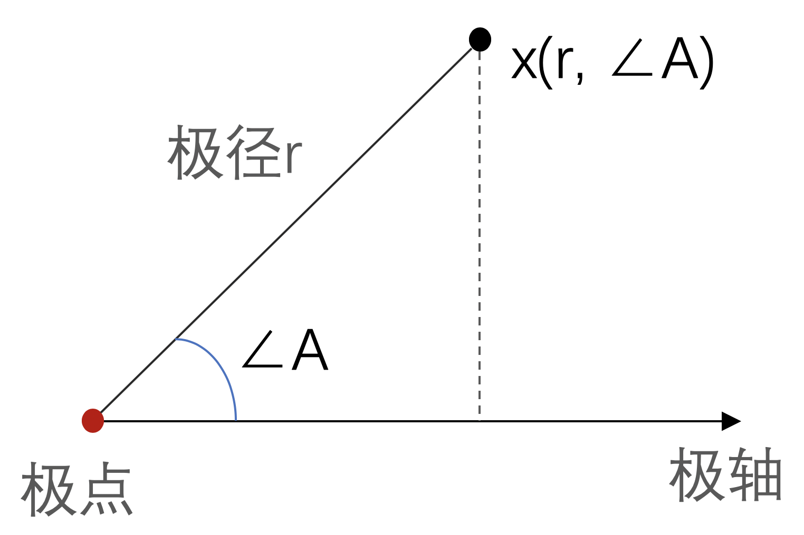

---
nav:
  title: Components
  path: /components
group:
  title: 图表组件
  path: /component
  order: 3
order: 3
---

# 极坐标系

极坐标系是一个数学领域的概念。

> 官方解释：极坐标系，可以用于散点图和折线图。每个极坐标系拥有一个角度轴和一个半径轴。

官方解释：极坐标系，可以用于散点图和折线图。每个极坐标系拥有一个角度轴和一个半径轴。

极坐标系由极点、极轴、极径组成：

如图，在平面中任取一点 O 称为极点，由 O 出发任意取直线 ox 称为极轴，则平面上任意点 x 的坐标都可以使用点到极点的距离 r，以及点与极轴夹角的角度值 ∠a 表示，通常记录为 x(r, ∠a)。极坐标系支持折线图、散点图、柱状图类型。

## 2. 实例解说

### 2.1 基础示例

使用前，需要声明极坐标轴的容器、角度轴、径向轴，分别由下述属性定义：

- polar：极坐标系容器配置，可定义坐标系位置、半径、提示效果等，对应直角坐标系中的 grid 项；
- angleAxis：角度轴配置，可定义角度轴边界、数据范围等，对应直角坐标系中的 yAxis 项；
- radiusAxis：径向轴配置，可定义径向轴的边界、数据范围等，对应直角坐标系中的 xAxis 项； polar 配置比较简单，可参考[官方文档](https://echarts.apache.org/zh/option.html#polar)。angleAxis 与 radiusAxis 配置项略多，但功能上与直角坐标系的 yAxis、xAxis 相似，可对照学习。

<code src="./index.tsx"></code>

### 2.2 实现阿基米德螺旋

极坐标通过角度、距离定义坐标位置，所以如果图表的数值关系很容易通过圆角公式计算时，极坐标尤其有用。例如，极坐标下绘制阿基米德螺旋，只需使用公式 r = a + b \* θ ：

<code src="./demo.tsx"></code>

### 2.3 花瓣图

极坐标下绘制花瓣图，只需实现公式 r = a + b _ |sin(c _ θ)|。

<code src="./demo2.tsx"></code>

### 2.4 椭圆

<code src="./demo3.tsx"></code>

### 2.5 极坐标下的柱形图

<code src="./demo4.tsx"></code>

### 2.6 极坐标下的散点图

<code src="./demo5.tsx"></code>
